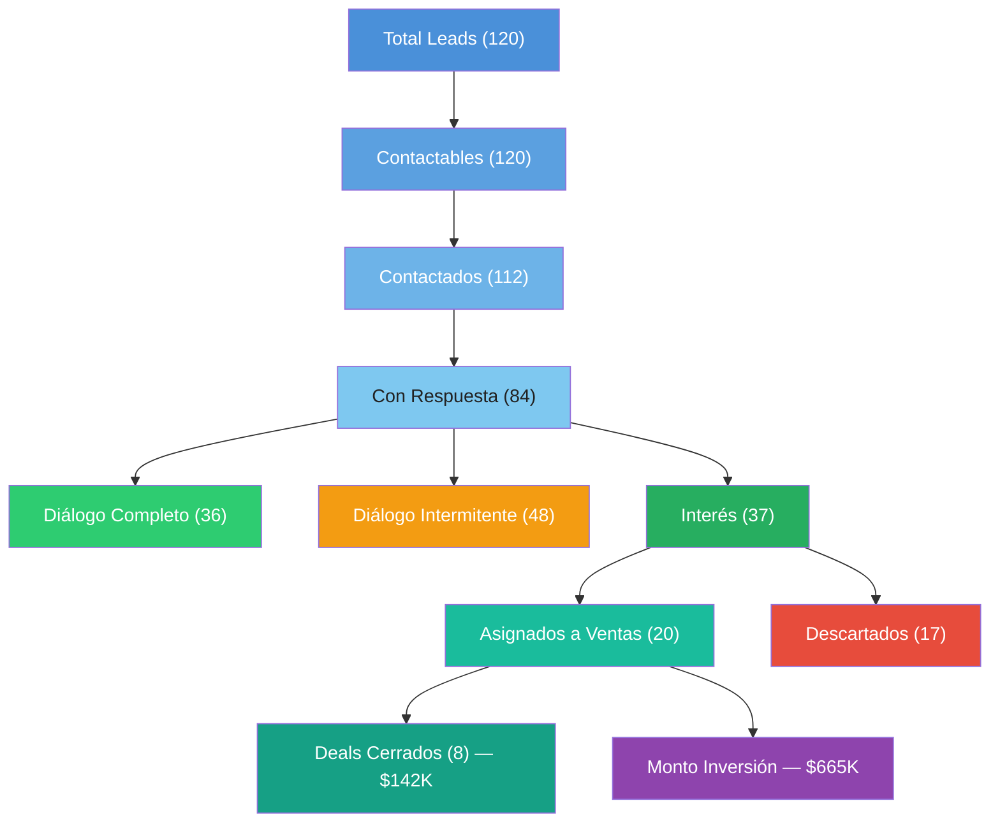

# 📊 Guía de Interpretación de Reportes — CRM Pedro

> **Última actualización:** Marzo 2026  
> Este documento explica cómo se calcula cada métrica del reporte mensual de leads, incluyendo segmentación, semáforos y análisis de razones de pérdida.

---

## 1. Período de Análisis

| Concepto | Ejemplo (Marzo 2026) |
|---|---|
| **Período actual** | Mar 1 – Mar 31, 2026 (120 leads) |
| **Período anterior** | Ene 30 – Mar 1, 2026 (107 leads) |

> [!IMPORTANT]
> El **período anterior** se calcula automáticamente: misma duración que el período actual (en este caso 30 días), desplazado hacia atrás desde la fecha de inicio del período actual.

---

## 2. Embudo General — 13 Métricas

Cada métrica se presenta con **3 columnas** (`Total`, `Manufacturers`, `Individuals`) y **3 sub-valores**:

| Sub-valor | Significado |
|---|---|
| **Cant** | Cantidad de leads que cumplen la condición |
| **%** | Porcentaje que ese segmento representa del Total |
| **Δ%** | Cambio vs período anterior: `(actual - anterior) / anterior × 100` |

---

### #1 — Total Leads

| Campo | Detalle |
|---|---|
| **Fórmula** | Todos los leads con `fecha_ingreso` dentro del rango del período |
| **Mar 2026** | 120 |
| **Período anterior** | 107 |
| **Δ%** | +12% |

---

### #2 — Contactables

| Campo | Detalle |
|---|---|
| **Fórmula** | Lead tiene `telefono_1` **o** `email` registrado |
| **Nota** | En nuestra data actual, todos los leads cumplen esta condición |
| **Mar 2026** | 120 |
| **Período anterior** | 107 |
| **Δ%** | +12% |

---

### #3 — Contactados

| Campo | Detalle |
|---|---|
| **Fórmula** | Lead tiene al menos **1 interacción** en `fact_interacciones` |
| **Mar 2026** | 112 |
| **Período anterior** | 103 |
| **Δ%** | +9% |

---

### #4 — Con Respuesta

| Campo | Detalle |
|---|---|
| **Fórmula** | Al menos 1 interacción con `resultado = 'Contesto'` |
| **Mar 2026** | 84 |
| **Período anterior** | 69 |
| **Δ%** | +22% |

---

### #5 — Diálogo Completo

| Campo | Detalle |
|---|---|
| **Fórmula** | **2+ toques consecutivos** con `resultado = 'Contesto'` |
| **Ejemplo** | Toque 2 y Toque 3 ambos con resultado `Contesto` |
| **Mar 2026** | 36 |
| **Período anterior** | 27 |
| **Δ%** | +33% |

---

### #6 — Diálogo Intermitente

| Campo | Detalle |
|---|---|
| **Fórmula** | Tiene `Contesto` pero **NO** en toques consecutivos |
| **Ejemplo** | Toque 1 → Contesto, Toque 2 → No, Toque 3 → Contesto |
| **Mar 2026** | 48 |
| **Período anterior** | 42 |
| **Δ%** | +14% |

> [!NOTE]
> **Diálogo Completo** + **Diálogo Intermitente** = todos los leads **Con Respuesta** (métrica #4). La diferencia está en la calidad del engagement: consecutivo vs. esporádico.

---

### #7 — Interés

| Campo | Detalle |
|---|---|
| **Fórmula** | `fact_calificacion.mostro_interes_genuino = 'Sí'` |
| **Mar 2026** | 37 |
| **Período anterior** | 27 |
| **Δ%** | +37% |

---

### #8 — Descartados

| Campo | Detalle |
|---|---|
| **Fórmula** | `fact_leads.status = 'Perdido'` |
| **Mar 2026** | 17 |
| **Período anterior** | 27 |
| **Δ%** | −37% |

---

### #9 — Asignados a Ventas

| Campo | Detalle |
|---|---|
| **Fórmula** | `fact_leads.status = 'Paso a Ventas'` |
| **Mar 2026** | 20 |
| **Período anterior** | 15 |
| **Δ%** | +33% |

---

### #10 — Carry Over

| Campo | Detalle |
|---|---|
| **Fórmula** | Leads que ingresaron **ANTES** del período actual pero fueron asignados a ventas **DURANTE** el período |
| **Mar 2026** | ~1 |
| **Período anterior** | ~1 |
| **Δ%** | 0% |

> [!TIP]
> El Carry Over ayuda a entender cuántos leads "arrastrados" de meses anteriores siguen avanzando en el pipeline. Un valor alto puede indicar ciclos de venta más largos.

---

### #11 — Monto Inversión

| Campo | Detalle |
|---|---|
| **Fórmula** | Suma de `fact_deals.monto_proyeccion` de deals vinculados a leads del período |
| **Mar 2026** | $665K |
| **Período anterior** | $476K |
| **Δ%** | +40% |

---

### #12 — Deals Cerrados

| Campo | Detalle |
|---|---|
| **Fórmula** | Deals con `status_venta = 'Vendido'` vinculados a leads del período |
| **Mar 2026** | 8 |
| **Período anterior** | 3 |
| **Δ%** | +167% |

---

### #13 — Monto Cierres

| Campo | Detalle |
|---|---|
| **Fórmula** | Suma de `fact_deals.monto_cierre` de deals con `status_venta = 'Vendido'` |
| **Mar 2026** | $142K |
| **Período anterior** | $76K |
| **Δ%** | +87% |

---

## 3. Segmentación: Manufacturers / Individuals

La segmentación en las columnas `Manufacturers` e `Individuals` se determina por el campo `fact_calificacion.tipo_membresia`:

| Valor de `tipo_membresia` | Columna en el reporte |
|---|---|
| `Manufacturers` | **Manufacturers** |
| `Individuals` | **Individuals** |
| `Attraction` u otro | Solo suma en **Total** |
| Sin calificación | Solo suma en **Total** |

> [!NOTE]
> Un lead sin registro en `fact_calificacion` o con un `tipo_membresia` diferente a Manufacturers/Individuals solo aparece en la columna **Total**, nunca en las sub-columnas.

---

## 4. Incontactables

Leads que no pudieron ser contactados por razones de calidad de datos:

| Métrica | Condición | Notas |
|---|---|---|
| **Duplicado** | `status = 'Duplicado'` | Lead repetido en la base de datos |
| **Equivocado** | `status = 'Inválido'` | Datos de contacto incorrectos |
| **SPAM** | — | No hay dato en la BBDD (siempre **0**) |

---

## 5. Semáforo Contesto / No Contesto

Grilla de **canal × número de toque**. Cada celda cuenta cuántos leads tuvieron una interacción que coincida con:

- Ese **canal** (WhatsApp, Llamada, Email, etc.)
- Ese **número de toque** (1, 2, 3…)
- Ese **resultado** (`Contesto` o `No Contesto`)

> [!TIP]
> El semáforo permite identificar rápidamente qué canales y en qué momento del seguimiento tienen mejor tasa de respuesta. Ejemplo: si el toque 1 por WhatsApp tiene más `Contesto` que los demás, conviene priorizar ese canal en el primer contacto.

---

## 6. Razones No Pasó a Ventas

Para leads con `status = 'Perdido'`, se revisan los **campos BANT** en `fact_calificacion`:

| Razón | Campo evaluado | Valor que activa |
|---|---|---|
| **No perfil** | `perfil_adecuado` | `'No'` |
| **Sin presupuesto** | `tiene_presupuesto` | `'No'` |
| **Sin interés** | `mostro_interes_genuino` | `'No'` |
| **Necesita tercero** | `necesita_decision_tercero` | `'Sí'` |
| **No entendió marketing** | `entendio_info_marketing` | `'No'` |

> [!NOTE]
> **BANT** = Budget (Presupuesto), Authority (Autoridad/Decisor), Need (Necesidad/Interés), Timeline (no aplica directamente aquí). Este framework ayuda a calificar si un lead está listo para ventas.

---

## 7. Razones Perdió la Venta

Para deals con `status_venta = 'Perdido'`, se agrupa por el campo `razon_perdida`.

**Ejemplo Marzo 2026** — 3 deals perdidos:

| Razón | Cantidad |
|---|---|
| Se fue con otra solución | 1 |
| Precio muy alto | 1 |
| No era el perfil | 1 |

---

## Flujo Visual del Embudo

